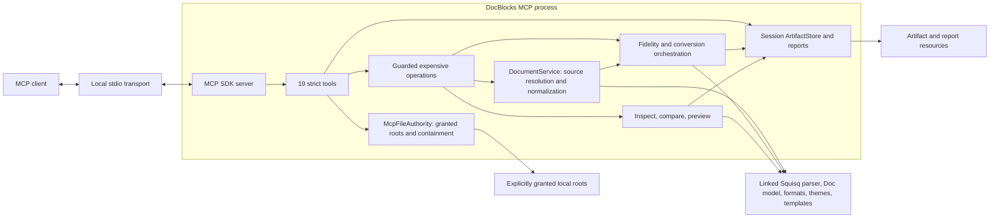

# DocBlocks MCP architecture and protocol guide

This is the authoritative guide to the MCP server started by `docblocks mcp`.
Canonical wire types, exact runtime parsers, and output schemas live in
`packages/core/src/mcp`; this document explains how that contract is assembled and
implemented by `packages/cli/src/mcp`.

The current server has these non-negotiable properties:

- local stdio transport only;
- wire version 1 with strict inputs and exact structured outputs;
- exactly 19 canonical tools and no legacy aliases;
- no filesystem authority unless a root is granted at startup;
- artifact-first conversion, bundling, previewing, and theme application;
- durable output only through `save_artifact`;
- live format, theme, template, and transform discovery from the resolved Squisq
  APIs; repository development and assurance physically link those APIs to the
  sibling `..\squisq` source checkout.

## System structure



### Ownership map

| Boundary                    | Canonical source                                  | Responsibility                                                            |
| --------------------------- | ------------------------------------------------- | ------------------------------------------------------------------------- |
| Wire names and result types | `packages/core/src/mcp/types.ts`                  | Versioned public contract and the exact tool-name tuple.                  |
| Runtime boundary parsing    | `packages/core/src/mcp/wire.ts`                   | Exact keys, limits, branded paths, envelopes, and nested validation.      |
| Shared input/output schemas | `packages/core/src/mcp/zod.ts`                    | Strict shared source/path inputs and exact output schemas for every tool. |
| Server assembly             | `packages/cli/src/mcp/server.ts`                  | Readiness, operation admission/cancellation, and bounded server shutdown. |
| Stdio/process lifecycle     | `packages/cli/src/commands/mcp.ts`                | Transport construction, stdin/signals, cleanup, and process exit codes.   |
| Tools and resources         | `agentic-tools.ts`, `discovery-tools.ts`          | Per-tool inputs, target union, annotations, results, and resource links.  |
| Source normalization        | `document-service.ts`                             | Authority-aware reads and one canonical Squisq document/container view.   |
| Conversion                  | `conversion-service.ts`, `rendered-conversion.ts` | Target policy, fidelity, caching, rollback, and rendered/hybrid outputs.  |
| Understanding               | `intelligence.ts`, `preview-service.ts`           | Inspection, validation, comparison, and bounded visual previews.          |
| Filesystem authority        | `authority.ts`, `contained-file.ts`               | Root grants, physical containment, bounded reads, and safe publication.   |
| Session outputs             | `artifact-store.ts`                               | Immutable artifacts, reports, quotas, expiry, resources, and cleanup.     |
| Authoring assistance        | `prompts.ts`                                      | Prompts and linked-Squisq completions.                                    |

## Lifecycle

Startup resolves and physically validates all granted roots and creates the session
artifact directory before the server admits transport requests. A guarded,
source-based tool normally follows this path:

1. The SDK validates the strict input schema.
2. `OperationGuard` admits the request under the concurrency and time budgets and
   combines client, server, timeout, and shutdown cancellation.
3. When the operation consumes a canonical document source, `DocumentService`
   normalizes it through Squisq into Markdown, a Squisq `Doc`, a content container,
   assets, and source provenance.
4. A read-only intelligence tool returns bounded structured data, or a producing
   tool publishes immutable artifacts and resource links.
5. Every tool returns the exact v1 success/error envelope.

Catalogs, `list_roots`, `get_conversion_report`, fixed resources, resource-template
reads, and prompts skip `OperationGuard`. `save_artifact` is guarded but works from
an artifact and destination rather than through `DocumentService`; binary
theme/layout tools likewise use their format-specific bounded readers where needed.

The CLI waits for stdin end/close, transport close, SIGINT, or SIGTERM. Shutdown
stops admission, aborts active work, drains for up to five seconds by default,
closes the transport, and removes the session artifact store. SIGINT and SIGTERM use
exit codes 130 and 143 after cleanup.

Artifacts, reports, cache entries, resource URIs, and authority mappings belong to
one server process. Root ID strings are deterministic physical-root hashes and may
recur in another process, but carry no authority without that process's matching
startup grant. None of these values is a remote URL or durable job handle.

## Canonical tool catalog

All input objects are strict: unknown fields are errors, including fields nested in
sources, targets, assets, and destinations. The tool list below is exhaustive.

<!-- BEGIN MCP TOOL CATALOG -->

| Tool                     | Class             | Purpose                                                                           |
| ------------------------ | ----------------- | --------------------------------------------------------------------------------- |
| `list_roots`             | read-only         | List opaque read/write root aliases granted at startup.                           |
| `get_conversion_report`  | read-only         | Retrieve the stored report for a conversion-backed artifact.                      |
| `convert_document`       | artifact-creating | Convert one normalized source into 1 through 12 immutable artifacts.              |
| `create_document_bundle` | artifact-creating | Stage Markdown and explicit assets as an immutable DBK working artifact.          |
| `save_artifact`          | materializing     | Persist one artifact with no-replace or hash-conditional replacement.             |
| `inspect_document`       | read-only         | Return bounded metadata, structure, items, assets, theme, and diagnostics.        |
| `preview_document`       | artifact-creating | Produce bounded, paginated image artifacts for visual review.                     |
| `compare_documents`      | read-only         | Compare semantic and structural retention between two sources.                    |
| `get_authoring_context`  | read-only         | Return a focused authoring contract, safe defaults, and optional recommendations. |
| `list_templates`         | read-only         | List linked Squisq template IDs and summaries.                                    |
| `describe_template`      | read-only         | Describe exact template annotations and inputs.                                   |
| `recommend_templates`    | read-only         | Profile document blocks and recommend compatible Squisq templates.                |
| `describe_theme`         | read-only         | Describe a built-in or document-embedded theme.                                   |
| `infer_theme_from_file`  | read-only         | Infer reusable theme and optional layout information from an imported file.       |
| `inspect_pptx_layouts`   | read-only         | Inspect slide size, masters, layouts, usage, and template mapping.                |
| `apply_inferred_theme`   | artifact-creating | Apply an inferred theme/layout set and return a DBK artifact.                     |
| `list_formats`           | read-only         | List live linked-registry import and export capabilities.                         |
| `list_themes`            | read-only         | List live linked Squisq themes.                                                   |
| `list_transform_styles`  | read-only         | List live linked Squisq transform styles.                                         |

<!-- END MCP TOOL CATALOG -->

Four tools create temporary artifacts without writing a user path:
`convert_document`, `create_document_bundle`, `preview_document`, and
`apply_inferred_theme`. `save_artifact` is the sole materializing tool and is marked
destructive because its conditional replacement mode can change an existing file.
The other 14 tools are read-only and idempotent.

### Important input bounds

| Tool                    | Key constraints                                                                                     |
| ----------------------- | --------------------------------------------------------------------------------------------------- |
| `convert_document`      | `source`; 1-12 distinct `targets`; optional `themeId`, `transformId`, `autoTemplates`, and `title`. |
| `inspect_document`      | `maxBlocks` defaults to 200 and is at most 2,000; opaque nullable cursor.                           |
| `preview_document`      | `maxItems` is 1-20 per call; optional start index and 160-1920 by 90-1920 dimensions.               |
| `recommend_templates`   | At most 256 candidate IDs and at most 100 analyzed blocks.                                          |
| `get_authoring_context` | Optional target, goal, source, and at most 100 recommended blocks.                                  |

Clients should inspect the schemas returned by MCP rather than hand-building a
looser local copy.

## Exact document-source model

Every source is exactly one member of this union. Unknown keys are rejected. The
nullable `name` on Markdown/bundle sources and nullable `format` on file sources may
be omitted; omission is canonicalized to `null`.

```json
{
  "kind": "markdown",
  "markdown": "# Quarterly review",
  "name": "quarterly-review.md"
}
```

```json
{
  "kind": "file",
  "rootId": "root-0123456789abcdef",
  "path": "reports/quarterly-review.docx",
  "format": null
}
```

```json
{
  "kind": "artifact",
  "uri": "docblocks://artifacts/00000000-0000-4000-8000-000000000000"
}
```

```json
{
  "kind": "bundle",
  "markdown": "# Field report\n\n",
  "name": "field-report.md",
  "assets": [
    {
      "path": "media/site.jpg",
      "source": {
        "kind": "file",
        "rootId": "root-0123456789abcdef",
        "path": "photos/site.jpg"
      },
      "mimeType": "image/jpeg",
      "altText": "Construction site viewed from the east",
      "credit": "Field team",
      "license": null
    }
  ]
}
```

An asset source can instead be `{ "kind": "artifact", "uri": "..." }`. Inline
Markdown is limited to 20 Mi characters. A bundle accepts at most 256 assets and
100 MiB of aggregate asset bytes, rejects duplicate or reserved paths, and stores
attribution in `.docblocks/assets.json`. The separately bounded Markdown is not part
of that asset-byte counter. A loose Markdown file never receives implicit
sibling-file authority; use a bundle or DBK when media must travel with the document.

File and asset paths are canonical root-relative `WorkspacePath` values with
forward slashes. Absolute paths, drive-qualified paths, backslashes, traversal,
empty segments, control characters, and physical root escapes are rejected.

Semantic document and conversion operations normalize each source kind through
linked Squisq. Registry imports become a bounded DBK/container representation before
parsing into the canonical Markdown and `Doc` views. Native MP4/GIF preview and the
binary theme/layout tools instead use their authority-scoped binary readers.

## Artifact-first workflow

A robust agent workflow is:

1. For durable output, call `list_roots` before drafting. If no returned root is
   write-enabled, stop and explain that the server must restart with
   `--allow-write`; do not switch to a shell or CLI converter. Inline sources and
   transient artifacts still work without roots.
2. Pass plain text or ordinary Markdown directly to `convert_document`; no preflight,
   inspection, preview, authoring-context call, or template annotation is required.
   For deliberate PPTX slide boundaries, use one level-one Markdown heading (`#`) per
   slide. Headings alone create the boundaries; do not add `---` between them unless
   a visible horizontal rule is intended. Unstructured text is still accepted.
3. `convert_document` chooses compatible templates automatically. Squisq annotations
   on headings are optional layout hints that take precedence. Call
   `get_authoring_context` only when exact starter examples, themes, transforms, target
   details, or source-based template recommendations are useful. Use
   `describe_template` for advanced author control and read `docblocks://authoring-guide`
   only when the complete catalog is required.
4. Use a bundle source when assets must travel with the document. When one complete
   draft will feed two or more inspect, preview, or convert calls, stage it once with
   `create_document_bundle` and reuse the returned artifact URI.
5. Use `inspect_document` or `preview_document` only when the user asks for document
   analysis or visual evidence. Check `previewBasis` before treating preview pixels as
   native verification.
6. Call `convert_document` once with all desired targets. They share one normalized
   source, and a failure rolls back every artifact created by that call.
7. Reuse an artifact as another tool's source, read a bounded artifact resource, or
   call `save_artifact` for durable output.
8. Retrieve `get_conversion_report` for conversion-backed artifacts when provenance
   and diagnostics matter.

### Example multi-target conversion

```json
{
  "source": {
    "kind": "markdown",
    "markdown": "# Quarterly review\n\n## Revenue\n\nRevenue grew 18%.",
    "name": "quarterly-review.md"
  },
  "targets": [
    {
      "format": "pptx",
      "fidelity": "editable-native",
      "slideBreak": "h2"
    },
    {
      "format": "pdf",
      "fidelity": "rendered-fidelity",
      "pageSize": "letter"
    }
  ],
  "themeId": "documentary",
  "autoTemplates": true,
  "title": "Quarterly review"
}
```

Conversion computes a content-addressed cache key from source and asset provenance,
source diagnostics, engine versions, target/fidelity options, theme, transform, and
title. Only completed immutable artifacts are reused, and the per-store cache is
limited to 64 entries. Native multi-target conversion prepares the linked Squisq
source once. Reports are attached only after the artifact succeeds; report failure
discards the artifact.

## Formats, fidelity, and options

The live `list_formats` tool and `docblocks://formats` resource are the runtime
source of truth. This checked catalog mirrors the linked checkout:

<!-- BEGIN FORMAT CATALOG -->

| ID        | Import | Export | Supported fidelity                                           |
| --------- | :----: | :----: | ------------------------------------------------------------ |
| `md`      |  yes   |  yes   | `semantic`                                                   |
| `docx`    |  yes   |  yes   | `semantic`, `editable-native`                                |
| `pdf`     |  yes   |  yes   | `semantic`, `rendered-fidelity`, `hybrid`                    |
| `pptx`    |  yes   |  yes   | `semantic`, `editable-native`, `rendered-fidelity`, `hybrid` |
| `xlsx`    |  yes   |  yes   | `semantic`, `editable-native`                                |
| `csv`     |  yes   |  yes   | `semantic`                                                   |
| `html`    |  yes   |  yes   | `semantic`                                                   |
| `htmlzip` |   no   |  yes   | `semantic`                                                   |
| `epub`    |   no   |  yes   | `semantic`                                                   |
| `dbk`     |  yes   |  yes   | `semantic`, `editable-native`                                |
| `mp4`     |   no   |  yes   | `rendered-fidelity`                                          |
| `gif`     |   no   |  yes   | `rendered-fidelity`                                          |
| `png`     |   no   |  yes   | `rendered-fidelity`                                          |

<!-- END FORMAT CATALOG -->

Default fidelity is `editable-native` for DOCX and PPTX,
`rendered-fidelity` for MP4, GIF, and PNG, and `semantic` for every other format.
Rendered-fidelity and hybrid PPTX/PDF use Squisq player capture; native/editable
targets use the linked registry exporter.

Target objects expose format-specific controls:

| Format            | Additional target fields                                                                                            |
| ----------------- | ------------------------------------------------------------------------------------------------------------------- |
| `md`, `dbk`       | Fidelity only.                                                                                                      |
| `docx`            | `title`, `author`, `description`, `defaultFont`, `defaultFontSize` (6-96).                                          |
| `pdf`             | `title`, `author`, `pageSize` (`letter`/`a4`), `margin` (0-288), `defaultFontSize` (6-96), render `width`/`height`. |
| `pptx`            | Metadata; `slideBreak` (`h1`/`h2`/`heading`—headings need no `---` separator); font and render dimensions.          |
| `xlsx`            | `title`, `author`, `sheetNamePrefix` (at most 31 characters).                                                       |
| `csv`             | `delimiter` (1-4 characters), `tableIndex` (0-10,000).                                                              |
| `html`, `htmlzip` | `mode` (`slideshow`/`static`), `autoPlay`, `title`.                                                                 |
| `epub`            | Metadata, `language`, `publisher`.                                                                                  |
| `mp4`             | `fps` (1-60), quality, orientation, dimensions, caption style, cover pre-roll, animations.                          |
| `gif`             | `fps` (1-30), orientation, dimensions, captions, pre-roll, animations, loop, palette, dithering, Bayer scale.       |
| `png`             | Dashboard image: `resolution` preset **or** `width`/`height`, `layout`, `style`, `title` band.                      |

The format-specific schema is stricter than a generic options map. Unsupported
fidelity is a machine-actionable error with the accepted alternatives.

### Dashboard images (`png`)

The `png` target converts a document to a single raster image by rendering its
**Dashboard** rendition — Squisq's projection of a whole document onto one canvas,
alongside slideshow and video. It needs headless Chromium but no FFmpeg.

Every field is optional, and each one omitted defers to the document's own
`squisq-dashboard-*` frontmatter, so a bare `{"format":"png"}` reproduces what the
author sees in the editor's Dashboard view.

| Field              | Accepted values                                                                              |
| ------------------ | -------------------------------------------------------------------------------------------- |
| `resolution`       | `hd`, `fhd` (default), `4k`, `square`, `square-2k`, `portrait`, `portrait-4k`, `standard`    |
| `width` / `height` | 64-7,680 pixels each. Both required together; mutually exclusive with `resolution`           |
| `layout`           | A layout id, or `auto` to pick by block count. Document-declared custom layouts are accepted |
| `style`            | `basic`, `card`, `panel`, `accent` — the cell dressing, orthogonal to the layout's geometry  |
| `title`            | Whether the document-title band renders                                                      |

```json
{
  "format": "png",
  "resolution": "square",
  "layout": "auto",
  "style": "accent",
  "title": false
}
```

`themeId` and `transformId` on the request compose with these: the transform
restyles content before projection, and the theme supplies the palette every cell
style derives its surfaces and accents from. The aspect ratio implied by the chosen
size selects the layout's landscape, portrait, or square variant.

### Media render budgets

Rendered-fidelity/hybrid PPTX and PDF conversion captures the complete document and
therefore uses a stricter non-paginated budget: at most 100 visual items,
120,000,000 aggregate pixels, and 64 MiB of captured image bytes. A source that
exceeds any of those limits fails before package publication; the 20-item
`preview_document` page size does not raise this full-document ceiling.

MP4/GIF validation likewise happens before browser/frame capture and is independent
of general artifact quotas.

| Limit                |         MP4 |         GIF |
| -------------------- | ----------: | ----------: |
| Maximum FPS          |          60 |          30 |
| Maximum dimension    |       3,840 |       1,920 |
| Maximum pixels/frame |   8,294,400 |   2,073,600 |
| Maximum duration     |       300 s |       120 s |
| Maximum frames       |      18,000 |       3,600 |
| Maximum frame-pixels | 2.2 billion | 600 million |

The linked renderer also applies a retained captured-PNG byte budget. Budget errors
tell the client to reduce duration, frame rate, or dimensions.

A Dashboard image is a single frame, so the duration, frame-rate, and frame-count
axes do not apply to it. What remains is checked before Chromium launches: each edge
must be 64-7,680 pixels and the image may not exceed 33,177,600 total pixels. Named
resolution presets are inside that ceiling by construction; only custom `width`/
`height` can breach it. Naming a preset **and** custom pixels is rejected as
contradictory rather than silently resolved.

## Understanding and visual QA

`inspect_document` returns metadata, statistics, outline, paginated block summaries,
tables, links, page/slide/sheet/frame items, assets and attribution, theme/layout
information, truncation flags, and diagnostics. Its opaque cursor paginates blocks;
clients must not synthesize cursors.

`compare_documents` compares text, structure, tables, media, themes, layouts,
metadata, timing, and accessibility. Its semantic score and change categories are
useful for round-trip regression testing but are not native-application pixel
comparison.

`preview_document` returns image artifacts, not inline base64. Interpret
`previewBasis` precisely:

- `source-render`: Squisq rendered the source document/container;
- `reconstructed-import`: Squisq rendered the normalized import, not pixels from
  Word, PowerPoint, Excel, or a native PDF application;
- `native-extracted`: a frame was extracted from the media source. MP4 and GIF
  currently return one bounded first-frame JPEG.

One call returns at most 20 items. Use `startIndex` to paginate.

Diagnostics are stable records with code, severity, stage, optional format and
location, occurrence count, remediation, and retryability. A result publishes at
most 500 entries; overflow is aggregated by severity so reports remain bounded.
`standalone-template-block` identifies annotations that accidentally created an
extra heading-less block. `template-body-not-rendered` identifies body prose assigned
to a template whose renderer ignores it, and `rendered-content-omitted` is an error
when a complete-body template does not materialize all of its body text.
`malformed-template-annotation` warns when an annotation-like span has unbalanced or
stray delimiters (for example `{[comparisonBar unit="%"}]}`) that the parser would
otherwise survive silently. `redundant-slide-separator` reports thematic breaks
removed immediately before PPTX slide-heading boundaries.

## Themes, templates, and layouts

The authoring workflow stays linked-Squisq-native and starts with one consolidated
call:

1. Plain text and ordinary Markdown can be converted without authoring discovery.
   `get_authoring_context` optionally returns compact text plus focused structured content: the
   requested target capability, safe default template, themes, transforms, and
   optional block-level recommendations. For PPTX without a source it returns the safe
   `content` template plus exact starter examples for `title`, `sectionHeader`,
   `statHighlight`, and `quote`; with a source it adds templates recommended for those blocks.
   Call `describe_template` for exact selected inputs, or read
   `docblocks://authoring-guide` for the complete linked catalog. `list_templates`
   remains a lightweight summary catalog. When the linked registry declares that the
   target exporter ignores template annotations (for example DOCX), recommendations
   stay scoped to content-first defaults.
2. `convert_document` chooses compatible templates automatically. Author optional
   overrides on headings as `# Heading {[content]}`. A standalone
   `{[content]}` creates an additional heading-less block and is only appropriate
   when that extra block is deliberate. For PPTX, use exactly one `#` heading per
   deliberate slide and do not add `---` between slide headings unless a visible
   horizontal rule is intended; unstructured text is still accepted.
3. Source normalization keeps ordinary headings in the linked `content` template,
   which renders the complete body; conversion may choose another compatible layout.
   Use `inspect_document` or `preview_document` only when the user
   requests semantic, metadata, or visual evidence.
4. Keep the complete Markdown as the authoritative source and pass it directly to
   `convert_document`, or pass a bundle source directly when assets are needed. A
   temporary local Markdown file is unnecessary. When one draft will feed two or
   more inspect, preview, or convert calls, stage it once with
   `create_document_bundle` and reuse the artifact URI as each call's source.
5. `describe_theme` resolves built-in themes and themes embedded in a source.
6. `infer_theme_from_file` imports reusable colors, typography, and optionally
   Office layout information.
7. `inspect_pptx_layouts` reports slide size, masters, layouts, usage, classification,
   and mapped template IDs.
8. `apply_inferred_theme` writes the inferred theme/layout set into a new DBK artifact
   without mutating the source.

Style selection is model-led by default. Agents infer theme and Squisq
Summarize/transform style from the brief, audience, tone, content shape, brand
constraints, and accessibility needs. They do not present raw IDs to the user or ask
separate theme, summarization, animation, and template questions. When the choice is
both materially ambiguous and important, an interactive agent asks one concise
high-level question with at most four semantic directions plus a “choose for me”
option; otherwise it uses safe defaults and proceeds.

`transformId` is consequential: the Squisq Summarize styles can change emphasis,
density, pacing, and structure. For source-preserving work, agents leave it unset
unless summarization or visual restructuring is requested or permitted. When a
transform is selected without an explicit user-requested theme, agents omit
`themeId` so Squisq can apply the transform’s preferred compatible theme. Motion is
treated as a high-level `none`, `subtle`, or `dynamic` preference rather than a list
of individual transitions; themes supply motion defaults, while
`animationsEnabled` honors explicit MP4/GIF motion preferences.

The binary inference boundary is intentionally narrower than `DocumentSource`:

- `infer_theme_from_file` accepts only file/artifact DOCX, PPTX, or XLSX sources;
- `inspect_pptx_layouts` accepts only file/artifact PPTX sources;
- `apply_inferred_theme.themeSource` accepts only file/artifact DOCX, PPTX, or XLSX
  sources, while its document `source` uses the normal source union;
- `describe_theme` resolves built-in themes without a source, but requires `source`
  to resolve a custom theme embedded in a document.

DocBlocks does not maintain a parallel theme/template vocabulary. Discovery,
content-retention behavior, and prompt completions call Squisq APIs at runtime.

## Artifacts, reports, and resources

An `ArtifactRef` includes its opaque ID and URI, format, MIME type, byte size,
SHA-256, source format/hash, suggested filename, applied options, engine versions,
creation time, and expiry. Artifacts are immutable and scoped to the current server.

The server exposes:

| Resource                      | Content                                                                             |
| ----------------------------- | ----------------------------------------------------------------------------------- |
| `docblocks://formats`         | Current linked-registry capability catalog.                                         |
| `docblocks://authoring-guide` | Current formats, fidelities, themes, transforms, templates, and preferred workflow. |
| `docblocks://artifacts/{id}`  | UTF-8 for text MIME types or base64 for bounded binary artifacts.                   |
| `docblocks://reports/{id}`    | JSON conversion report for a conversion-backed artifact.                            |

Artifact-producing tool results also include MCP resource links. Resource reads are
capped separately from artifact creation; use `save_artifact` for a result larger
than the resource-read budget.

The artifact and report URIs are resource templates with no enumeration callback;
clients use prefix completion over active artifact IDs. Report completion is
filtered to artifacts with attached reports. Only conversion-backed artifacts have
reports; preview image artifacts do not.

The store reserves artifact count and bytes before writing, publishes metadata only
after a cancellable staged write. At TTL expiry an artifact becomes unavailable and
is lazily collected by a subsequent store operation; shutdown always removes the
temporary directory. Multi-target conversion rolls back artifacts and cache entries
created by a failed call.

## Durable materialization

`save_artifact` accepts one of two exact destination shapes:

```json
{
  "artifactUri": "docblocks://artifacts/00000000-0000-4000-8000-000000000000",
  "destination": {
    "rootId": "root-0123456789abcdef",
    "path": "reports/quarterly-review.pptx",
    "ifExists": "error",
    "expectedSha256": null
  }
}
```

For the no-replace (`"ifExists": "error"`) shape, `expectedSha256` may be omitted;
the server canonicalizes omission to `null`. Conditional replacement continues to
require the current SHA-256.

or conditional replacement:

```json
{
  "artifactUri": "docblocks://artifacts/00000000-0000-4000-8000-000000000000",
  "destination": {
    "rootId": "root-0123456789abcdef",
    "path": "reports/quarterly-review.pptx",
    "ifExists": "replace",
    "expectedSha256": "0123456789abcdef0123456789abcdef0123456789abcdef0123456789abcdef"
  }
}
```

No-replace publication is the safest default. Replacement is serialized in the
server process, verifies the existing file's bounded SHA-256, stages the new bytes,
and revalidates immediately before atomic publication. Node filesystems do not offer
one portable storage-atomic compare-and-swap primitive, so an unrelated external
writer can still race the final publication boundary.

## Authority and containment

`docblocks mcp` starts with zero read and write roots. Grants are independent:

```bash
docblocks mcp --allow-read ./documents --allow-write ./exports
```

An empty `list_roots` result explicitly tells the agent that durable output is
unavailable and that the server must restart with `--allow-write`. The agent must not
bypass this authority boundary through a shell or direct CLI conversion.

Root IDs returned by `list_roots` are opaque usability aliases, not bearer tokens or
authority. The server still checks the requested operation against its startup grant.
It resolves roots physically before connecting, caps each direction at 64 roots,
and deduplicates exact physical roots. Nested/overlapping grants are allowed, while
read and write capabilities remain independently recorded and enforced.

Reads are cancellable 64 KiB chunks with containment and descriptor-identity checks
before and after I/O. Writes reject symlinks and missing parents, revalidate parent
identity, stage exclusively, and publish with no-replace or hash-conditional rules.
Errors for permission, conflict, cancellation, timeout, and invalid paths are not
translated into absence or success.

## Budgets and cancellation

Configurable startup budgets have non-bypassable ceilings:

| Budget                          | Default | Hard ceiling |
| ------------------------------- | ------: | -----------: |
| Read roots / write roots        |   0 / 0 |      64 each |
| Concurrent expensive operations |       2 |           32 |
| Operation timeout               |   120 s |      1,800 s |
| One granted input file          | 100 MiB |        1 GiB |
| One artifact                    | 500 MiB |      500 MiB |
| All artifacts                   |   1 GiB |        4 GiB |
| Artifact count                  |      64 |        1,024 |
| Artifact lifetime               |  30 min |         24 h |
| One artifact resource read      |  25 MiB |      100 MiB |
| One conversion report           |   8 MiB |       32 MiB |
| All conversion reports          |  64 MiB |      256 MiB |

The wire policy also caps identifiers, formats, paths, URIs, messages, arrays, image
dimensions, inline documents, and bundle asset counts. Archive normalization allows
at most 2,048 entries, 100 MiB per expanded entry and in total, and a 1,000:1
compression ratio. Those limits cover DBK/ZIP plus archive-based DOCX, PPTX, and
XLSX imports, and DBK output is reopened under the same policy before publication.

`OperationGuard` preserves the exact cancellation reason and reports current active
load/capacity on busy errors. Progress notifications are normalized into monotonic
0-100 progress. Filesystem reads, artifact reads/writes, conversion, player capture,
and media rendering all receive the operation signal.

## Structured outputs and errors

Every successful tool returns structured content in this exact envelope:

```json
{
  "version": 1,
  "kind": "success",
  "result": {},
  "error": null
}
```

Failures use:

```json
{
  "version": 1,
  "kind": "error",
  "result": null,
  "error": {
    "code": "machine-actionable-code",
    "message": "Bounded explanation",
    "stage": null,
    "format": null,
    "hint": null,
    "retryable": false,
    "operationLoad": null
  }
}
```

Nullable keys remain present. `operationLoad`, when non-null, contains `active` and
`capacity`. The envelope and every nested result are parsed against exact core
schemas before publication. Tool responses also include a bounded text mirror for
clients that do not consume structured content. When a conversion succeeds with
warnings, a concise warning summary is the first text content item and the complete
JSON mirror follows as the next text item; conversions without warnings retain the
JSON mirror as their first text item.

## Prompts and completions

The server publishes three prompts:

| Prompt                | Arguments                                                                               |
| --------------------- | --------------------------------------------------------------------------------------- |
| `create-presentation` | required `topic`; optional `style`, `theme`, `template`.                                |
| `create-video`        | required `topic`; optional `orientation` (`landscape`/`portrait`), `theme`, `template`. |
| `create-document`     | required `topic`; optional `format` (`docx`/`pdf`), `theme`, `template`.                |

Style, theme, and template completion is prefix-based, capped at 100 values, and
comes directly from linked Squisq. Prompt output tells the agent to infer a semantic
direction, choose automatically, and avoid presenting raw combinations to the user;
exact prompt arguments remain available for callers that already know the desired
IDs. Prompts do not create artifacts by themselves. `topic` is limited to 10,000
characters and style/theme/template IDs to 256 characters.

## How linked Squisq is used

The resolved Squisq dependencies provide the capability engine. In this repository,
assurance physically links them to the sibling source checkout:

- `createCliRegistry()` supplies every import/export direction and the Node-only
  MP4/GIF exporters;
- linked import and container APIs normalize Markdown, DBK/ZIP, Office, PDF,
  spreadsheets, CSV, and HTML exposed by the MCP source union and registry;
- the Markdown parser and `Doc` projection provide canonical semantic structure;
- native exporters provide semantic/editable DOCX, PPTX, PDF, XLSX, CSV, HTML,
  HTML ZIP, EPUB, DBK, Markdown, MP4, and GIF output as supported;
- the standalone player provides preview and rendered-fidelity pixels;
- theme, template, transform, recommendation, OOXML theme/layout, and video APIs
  provide the live authoring vocabulary and media behavior.

DocBlocks provides the protocol-facing policy around that engine: exact wire
contracts, root authority, source normalization policy, artifact/report lifecycle,
fidelity selection, rendered/hybrid packaging, inspection/validation/comparison,
budgets, progress, cancellation, and shutdown.

The Squisq CLI itself also supports JSON Doc input, but MCP does not expose a JSON
Doc source kind or registry format today.

Conversion artifact provenance records DocBlocks, Squisq CLI, Squisq Formats, and
Squisq runtime versions with a content-derived runtime fingerprint. Preview artifact
provenance records DocBlocks and the linked Squisq CLI renderer. Repository assurance
must compare against the physically linked `..\squisq` packages, never the npm copy.

## Extending the MCP

Keep extensions inside the existing boundaries:

- **New tool:** add the canonical core name and types, exact wire/Zod schemas,
  registration and annotations, bounded output behavior, and exhaustive protocol
  tests. Do not add an old-name alias.
- **New format:** implement and register it in linked Squisq first, then add explicit
  MCP target options/fidelity policy and linked-registry assurance.
- **New source kind:** add the core type/parser/schema and one normalization branch
  in `DocumentService`; do not let individual tools invent sources.
- **New authoring vocabulary:** add it to Squisq and consume its discovery API.
- **Remote transport:** treat this as a new security architecture. It requires
  authenticated principals, principal-scoped roots/artifacts/quotas, Origin checks,
  and durable task/cancellation cleanup; the local process assumptions cannot be
  reused unchanged.

## Verification

```bash
npm run test:eval:mcp
npm run test:mcp
npm run check:squisq-linked
npm run test:mcp:linked
npm run all
```

The repository-local [MCP content evaluation framework](mcp-evals.md) hosts Codex
against the built stdio server, preserves exact authored Markdown and Office
artifacts, applies deterministic and LLM judges, and supports paired A/B reports.
Its outputs stay under gitignored `reports/`.

`test:mcp` covers the protocol surface and adversarial authority/artifact behavior.
`test:mcp:linked` rebuilds and links the sibling checkout, runs focused Squisq
format/media tests, then runs the full MCP suite against that source. `npm run all`
is the canonical repository gate.

When any tool, format direction, or CLI command changes, update this guide and the
[CLI reference](cli.md) in the same change. The documentation contract test keeps
their checked catalogs aligned with the runtime constants.
